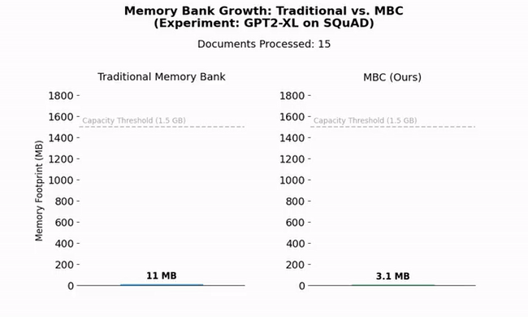

<h1 align="center">MBC: Memory Bank Compression for Continual Adaptation of Large Language Models</h1>

<p align="center">
  <a href="https://arxiv.org/abs/2601.00756">
    
  </a>
</p>

<p align="center">
  
</p>

<p align="center">
  This repository provides a PyTorch implementation of the MBC model proposed in the paper titled <b>Memory Bank Compression for Continual Adaptation of Large Language Models</b>.
  MBC is a memory-augmented continual learning model that reduces the memory bank footprint by 99.7% by compressing stored representations through codebook optimization and online resetting mechanisms. MBC improves QA accuracy by 11.84% (EM) and 12.99% (F1) over state-of-the-art baselines.
</p>

## Abstract
> Large Language Models (LLMs) have become a mainstay for many everyday applications. However, as data evolve their knowledge quickly becomes outdated. Continual learning aims to update LLMs with new information without erasing previously acquired knowledge. Although methods such as full fine-tuning can incorporate new data, they are computationally expensive and prone to catastrophic forgetting, where prior knowledge is overwritten. Memory-augmented approaches address this by equipping LLMs with a memory bank, that is an external memory module which stores information for future use. However, these methods face a critical limitation, in particular, the memory bank constantly grows in the real-world scenario when large-scale data streams arrive. In this paper, we propose MBC, a model that compresses the memory bank through a codebook optimization strategy during online adaptation learning. To ensure stable learning, we also introduce an online resetting mechanism that prevents codebook collapse. In addition, we employ Key-Value Low-Rank Adaptation in the attention layers of the LLM, enabling efficient utilization of the compressed memory representations. Experiments with benchmark question–answering datasets demonstrate that MBC reduces the memory bank size to 0.3\% when compared against the most competitive baseline, while maintaining high retention accuracy during online adaptation learning.

---

## Installation and Datasets
See [`INSTALL.md`](INSTALL.md) for details on setting up the environment and datasets.

---

## Training

The training script is `train.py`. Our experiments have been conducted on a single NVIDIA A100 80GB GPU but the code supports multi-GPU configurations through `accelerate`. It is also compatible with NVIDIA Blackwell architecture (CUDA 12.8+).

### Important Training Arguments

Training runs are configured using Hydra. You can specify a base LLM and dataset, and override any other parameters from the command line.

- **`model`**: The base LLM model configuration to use.
  - Provided configs: `distilgpt2`, `gpt2_large`, `gpt2_xl`, `Llama2_7b`.
- **`dataset`**: The dataset configuration to use.
  - Provided configs: `streamingqa`, `archivalqa`, `squad`.
- **`n_epochs`**: Total number of training epochs (default: 50).
- **`learning_rate`**: Peak learning rate (default: 1e-5).
- **`model.train_update_batch_size`**: The batch size per device for training.
- **`model.val_update_batch_size`**: The batch size for validation.
- **`model.grad_acc_steps`**: Number of steps to accumulate gradients over. The effective batch size is `train_update_batch_size * num_gpus * grad_acc_steps`.
- **`mixed_precision`**: Set to `fp16` or `bf16` to enable mixed-precision training. We recommend `bf16` because `fp16` does not go well with t5 (see: https://github.com/huggingface/transformers/issues/17978)
- **`wandb_log`**: Set to `true` to enable logging with Weights & Biases. You will also need to set `wandb_entity` and `wandb_key`.

### Example Training Commands

- **1) Train `DistilGPT2` on `StreamingQA` on a single GPU with our default settings. <DATA_DIR> is the path where the datasets are saved**:
  ```bash
  accelerate launch --config_file ./conf/accelerate_config.yaml --num_processes=1 train.py \
      model=distilgpt2 \
      dataset=streamingqa \
      dataset.data_dir=<DATA_DIR> \
      mixed_precision=bf16
  ```

- **2) Train `GPT2-Large` on `ArchivalQA` with WandB logging**:
  ```bash
  accelerate launch --config_file ./conf/accelerate_config.yaml --num_processes=1 train.py \
      model=gpt2_large \
      dataset=archivalqa \
      dataset.data_dir=<DATA_DIR> \
      mixed_precision=bf16 \
      wandb_log=true
  ```

- **3) Train `Llama2-7B` on `SQuAD`. <LLAMA_PATH> is the path to the local directory where your Llama 2 weights and tokenizer are saved (e.g., downloaded from HuggingFace)**:
  ```bash
  accelerate launch --config_file ./conf/accelerate_config.yaml --num_processes=1 train.py \
      model=llama2_7b \
      dataset=squad \
      mixed_precision=bf16 \
      quant_type=nf4 \
      model.llama_cache_dir=<LLAMA_PATH>
  ```

- **4) Multi-GPU Training**:  
    This project uses accelerate for distributed training. First, configure accelerate for your machine by running:  
    ```bash
    accelerate config
    ```  
    or by editing `conf/accelerate_config.yaml`.  
    Then, launch training using `accelerate launch` and select the number of processes based on the number of GPUs you have. For example, for 4 GPUs:  
    ```bash
    accelerate launch --config_file ./conf/accelerate_config.yaml --num_processes=4 train.py \
        model=gpt2_xl \
        dataset=squad \
        mixed_precision=bf16
    ```

---

## Evaluation (Online Adaptation)

The online adaptation evaluation script is `online_adapt.py`. This script first amortizes the context documents into a compressed memory bank and then answers queries by aggregating them with this bank, to produce a modulation for the base LLM.

### Important Testing Arguments

- **`model`**: The model configuration used during training (e.g., `distilgpt2`).
- **`dataset`**: The dataset configuration to test on (e.g., `streamingqa`).
- **`load_path`**: Path to the trained model checkpoint (`.pt` file) you want to evaluate.
- **`downsample_to`**: Number of documents to evaluate on (default: 1665).

### Example Testing Commands

- **1) Evaluate a trained MBC model on `DistilGPT2` and `StreamingQA` test set**:  
  Assuming your checkpoint is saved at `outputs/train_mbc_distilgpt2_.../best_f1.pt`.
  ```bash
  python online_adapt.py \
    model=distilgpt2 \
    dataset=streamingqa \
    dataset.data_dir=<DATA_DIR> \
    load_path=outputs/train_mbc_distilgpt2_streamingqa_YYYY-MM-DD_HH-MM-SS/best_f1.pt
  ```

- **2) Evaluate a trained MBC model on `Llama2-7B` and `ArchivalQA` test set**:  
  Assuming your checkpoint is saved at `outputs/train_mbc_llama2_7b_.../best_f1.pt`.
  ```bash
  python online_adapt.py \
    model=llama2_7b \
    dataset=archivalqa \
    dataset.data_dir=<DATA_DIR> \
    load_path=outputs/train_mbc_llama2_7b_archivalqa_YYYY-MM-DD_HH-MM-SS/best_f1.pt \
    quant_type=nf4 \
    model.llama_cache_dir=<LLAMA_PATH>

  ```

The results, including EM, F1 score, and performance metrics, will be printed to the console and saved in a `metrics_eval.csv` file inside a new `outputs/` directory.

-----

## Logging and Checkpoints

  - **Hydra Outputs**:
    All outputs, including logs, checkpoints, are saved in a directory created by Hydra, following the pattern `outputs/RUN_ID/`. The `RUN_ID` is defined in the config files and consists of the base LLM name, the dataset and the date the training/online adaptation script started (e.g., `train_mbc_distilgpt2_streamingqa_2025-09-14_13-57-05`).

  - **Weights & Biases (WandB)**:
    If you set `wandb_log=true`, training metrics will be logged to your specified WandB project (default: `MBC`). You need to define the entity and key.

  - **Checkpoints**:

      - Checkpoints are saved within the run's Hydra directory.
      - The training script saves the following models:
          - `best_val_loss.pt`: Model with the lowest validation QA loss.
          - `best_em.pt`: Model with the highest Exact Match score on the validation set.
          - `best_f1.pt`: Model with the highest F1 score on the validation set.
          - `last_epoch.pt`: Model from the latest training epoch.

-----

## Acknowledgment

This repository builds upon the [MAC](https://github.com/jihoontack/MAC) repository, with our MBC implementation and code refinements.